<div align="center">

<!-- ═══════ ANIMATED LAPTOP (assets/hero.svg) ═══════ -->


<br/>

<p>
  <a href="https://kabishs.github.io/kabish/"></a>
  <a href="https://github.com/kabishS"></a>
  <a href="https://linkedin.com/in/kabish"></a>
  <a href="https://www.instagram.com/itz._.kabish/"></a>
  
</p>

</div>

---

<div align="center">
  
</div>

```js
const kabish = {
  name: "Kabish S",
  education: "B.Tech Information Technology @ VSB College of Engineering Technical Campus",
  focus: "Java Full Stack Development",
  exploring: ["Software Testing", "Playwright with TypeScript"],
  buildingWith: ["Java", "JavaScript", "APIs", "AI", "Databases"],
  interestedIn: ["Software Development", "Web Development", "AI-powered applications"],
  motto: "Build • Learn • Create",
};
```

---

<div align="center">
  
</div>

<table align="center">
<tr>
<td align="center" width="220"><b>💻 Languages</b></td>
<td>

<br/>
<sub>Java · Python · HTML5 · CSS3 · JavaScript</sub>
</td>
</tr>
<tr>
<td align="center"><b>🧩 Frameworks & Libraries</b></td>
<td>


<br/>
<sub>Bootstrap · REST API Integration</sub>
</td>
</tr>
<tr>
<td align="center"><b>🧰 Tools & Platforms</b></td>
<td>

<br/>


<br/>
<sub>Git · GitHub · AI Tools (ChatGPT, Claude, Gemini)</sub>
</td>
</tr>
</table>

---

<div align="center">
  
</div>

<table>
<tr>
<td width="50%" valign="top">

### 📥 InboxFlow
AI-powered email inbox assistant that analyzes emails and turns them into actionable insights.

`AI` `APIs` `JavaScript` `Node.js` `Supabase`

[](https://github.com/kabishS/InboxFlow)

</td>
<td width="50%" valign="top">

### 🎤 Intervexa-AI
AI interview preparation platform with aptitude, coding, AI interviews, job search and profile analysis.

`HTML` `CSS` `JavaScript` `Groq API` `LocalStorage`

[](https://github.com/kabishS/Intervexa-AI)

</td>
</tr>
<tr>
<td width="50%" valign="top">

### 🔥 Burn-Ex
AI-based calorie estimation and fitness tracking system using computer vision.

`JavaScript` `MediaPipe` `TensorFlow.js` `Supabase` `Chart.js`

[](https://kabishs.github.io/BurnEx/)

</td>
<td width="50%" valign="top">

### 🔌 API-Hub
Open-source collection of free public APIs organized across multiple categories.

`APIs` `JavaScript` `GitHub`

[](https://github.com/kabishS)

</td>
</tr>
</table>

---

<div align="center">
  

**TURNING IDEAS INTO INTELLIGENT SOLUTIONS**

</div>

| Project | What it does |
|:--|:--|
| 📥 **InboxFlow** | AI Email & Productivity Assistant |
| 🔥 **Burn-Ex** | AI-Based Calorie Estimation System |
| 📊 **SkillPulse** | Employment Outcomes & Skill Gap Tracking Platform |

- 🚀 Participated in hackathons, coding events & developer programs
- 💡 Built solutions involving AI, APIs, databases & modern web technologies

<details>
<summary><b>📜 Certifications (click to expand)</b></summary>

<br/>

- ☁️ **Google Cloud Skills Boost Arcade**
- 💻 **Meta**: Introduction to Front-End Development
- 🤖 **AI Prompt Engineering Masterclass**: ChatGPT, Claude & Gemini
- ☕ **Java Programming**: Scaler

</details>

---

<div align="center">
  

<!-- A new random quote each time the page is refreshed -->


<br/>


</div>
