<!-- ============ PART 1: HERO (laptop + about me) ============ -->
<table>
  <tr>
    <td width="50%" align="center" valign="middle">
      
    </td>
    <td width="50%" align="left" valign="middle">

## $\color{#FFD43B}{\textsf{About Me 🤗}}$

Hi, I’m Kabish, a B.Tech IT student and aspiring Software Developer.
I enjoy building web applications and exploring AI technologies.
I’m passionate about learning, creating, and improving my development skills.

</td>
  </tr>
</table>

<!-- ============ PART 2: TYPING / PROFILE BUTTONS ============ -->

  

<h2>🛠️ Tech Stack</h2>

<h3>💻 Languages</h3>

  
  
  
  

<h3>🌐 Frontend</h3>

  
  
  
  

<h3>⚙️ Backend &amp; Database</h3>

  
  
  
  

<h3>🧰 Tools</h3>

  
  
  

<h3>🤖 AI Tools</h3>

  
  
  
  

<!-- ============ PART 3: FEATURED PROJECTS ============ -->
<h2 align="center">🚀 Featured Projects</h2>

| Project | Description | Tech Stack | Link |
| ------- | ----------- | ---------- | ---- |
| 🎤 **Intervexa-AI** | AI-powered interview preparation platform with aptitude, coding, AI interviews, job search and profile analysis | HTML, CSS, JavaScript, Groq API, LocalStorage | [View](https://github.com/kabishS/Intervexa-AI) |
| 🔥 **Burn-Ex** | AI-based calorie estimation and fitness tracking system using computer vision | JavaScript, MediaPipe, TensorFlow.js, Supabase, Chart.js | [View](https://github.com/kabishS/BurnEx) |
| 🔌 **API-Hub** | Open-source collection of free public APIs organized across multiple categories | APIs, JavaScript, GitHub | [View](https://github.com/kabishS/APIs-Hub) |

<!-- ============ PART 4: CERTIFICATIONS & ACHIEVEMENTS ============ -->
<h2 align="center">📜 Certifications &amp; Achievements</h2>

- ☁️ **Google Cloud Skills Boost Arcade**
- 💻 **Meta — Introduction to Front-End Development**
- 🤖 **AI Prompt Engineering Masterclass — ChatGPT, Claude & Gemini**
- ☕ **Java Programming — Scaler**

<!-- ============ PART 5: CONTRIBUTION STREAK ============ -->
<h2 align="center">🔥 Contribution Streak</h2>

  

<!-- ============ PART 6: CONNECT WITH ME ============ -->
<h2 align="center">🤝 Connect With Me</h2>

  
  
  
  

